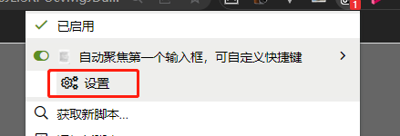
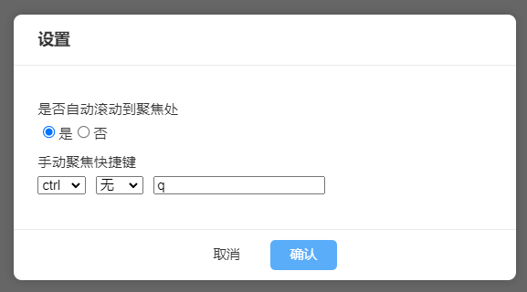

# @vinsea/tampermonkey-autofocus

## 说明 what can I do
自动聚焦第一个`input`框，默认可以使用 `ctrl + q` 触发自动聚焦，快捷键可修改

automaticly focus on first input box, manually trigger with shortcut keys `ctrl q` (can be modified on the settings)

## 安装 install
[安装脚本|install](https://greasyfork.org/zh-CN/scripts/444304-auto-focus-on-first-input)

## 设置 settings
1. 默认会自动滚动到聚焦处
1. the browser will scroll the element into view after focusing it,if this is set to false/`否`, no scrolling will occur.

2. 设置快捷键
2. Set shortcut keys

## 其他 others

[更新日志|changelog](CHANGELOG.md)
